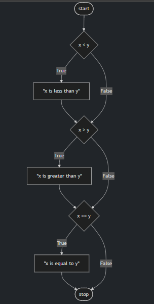
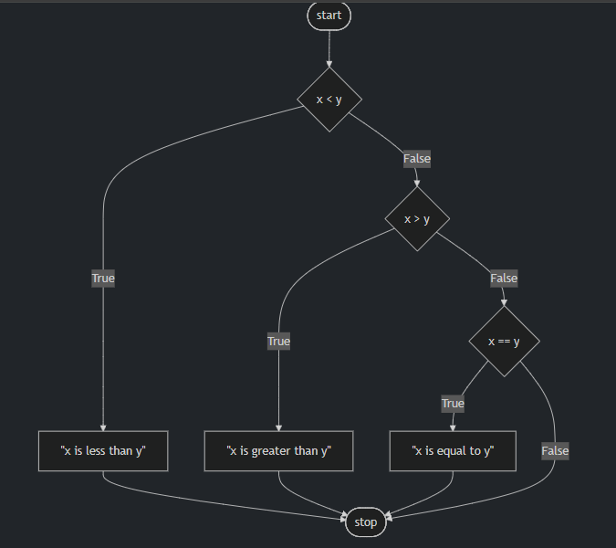
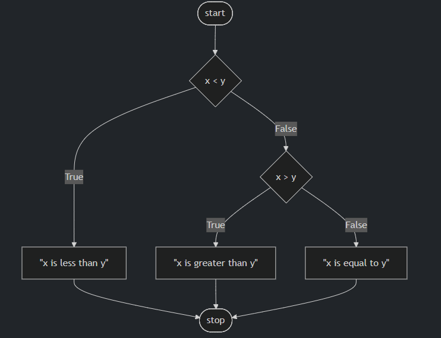
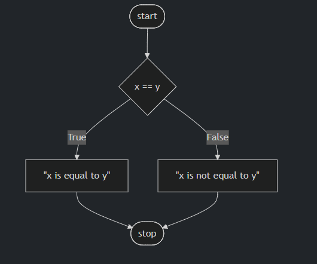

Control Flow, elif, and else
Further revise your code as follows:
```py
x = int(input("What's x? "))
y = int(input("What's y? "))

if x < y:
    print("x is less than y")
if x > y:
    print("x is greater than y")
if x == y:
    print("x is equal to y")
```
Notice how you are providing a series of if statements. First, the first if statement is evaluated. Then, the second if statement runs its evaluation. Finally, the last if statement runs its evaluation. This flow of decisions is called “control flow.”



- This program can be improved by not asking three consecutive questions. After all, not all three questions can have an outcome of true! Revise your program as follows:

```py
x = int(input("What's x? "))
y = int(input("What's y? "))

if x < y:
    print("x is less than y")
elif x > y:
    print("x is greater than y")
elif x == y:
    print("x is equal to y")
```
Notice how the use of elif allows the program to make fewer decisions. First, the if statement is evaluated. If this statement is found to be true, all the elif statements will not be run at all. However, if the if statement is evaluated and found to be false, the first elif will be evaluated. If this is true, it will not run the final evaluation.

Our code can be represented as follows:


- While your computer may not notice a difference speed-wise between our first program and this revised program, consider how an online server running billions or trillions of these types of calculations each day could definitely be impacted by such a small coding decision.
- There is one final improvement we can make to our program. Notice how logically elif x == y is not a necessary evaluation to run. After all, if logically x is not less than y AND x is not greater than y, x MUST equal y. Therefore, we don’t have to run elif x == y. We can create a “catch-all,” default outcome using an else statement. We can revise as follows:
```py 
x = int(input("What's x? "))
y = int(input("What's y? "))

if x < y:
    print("x is less than y")
elif x > y:
    print("x is greater than y")
else:
    print("x is equal to y")
```
Notice how the relative complexity of this program has decreased through our revision.

Our code can be represented as follows:



# Oprators
## or
- or allows your program to decide between one or more alternatives. For example, we could further edit our program as follows:
```py
x = int(input("What's x? "))
y = int(input("What's y? "))

if x < y or x > y:
    print("x is not equal to y")
else:
    print("x is equal to y")
```
Notice that the result of our program is the same, but the complexity is decreased. The efficiency of our code is increased.

- At this point, our code is pretty great. However, could the design be further improved? We could further edit our code as follows:
```py
x = int(input("What's x? "))
y = int(input("What's y? "))

if x != y:
    print("x is not equal to y")
else:
    print("x is equal to y")
```
Notice how we removed the or entirely and simply asked, “Is x not equal to y?” We ask one and only one question. Very efficient!

- For the purpose of illustration, we could also change our code as follows:
```py
x = int(input("What's x? "))
y = int(input("What's y? "))

if x == y:
    print("x is equal to y")
else:
    print("x is not equal to y")
```
Notice that the == operator evaluates if what is on the left and right are equal to one another. The use of double equal signs is very important. If you use only one equal sign, an error will likely be thrown by the interpreter.

- Our code can be illustrated as follows:


## and
- Similar to or, and can be used within conditional statements.
- Execute in the terminal window code grade.py. Start your new program as follows:
```py
score = int(input("Score: "))

if score >= 90 and score <= 100:
    print("Grade: A")
elif score >=80 and score < 90:
    print("Grade: B")
elif score >=70 and score < 80:
    print("Grade: C")
elif score >=60 and score < 70:
    print("Grade: D")
else:
    print("Grade: F")
```
Notice that by executing python grade.py, you will be able to input a score and get a grade. However, notice how there is potential for bugs.

- Typically, we do not want to ever trust our users to input the correct information. We could improve our code as follows:
```py
  score = int(input("Score: "))

  if 90 <= score <= 100:
      print("Grade: A")
  elif 80 <= score < 90:
      print("Grade: B")
  elif 70 <= score < 80:
      print("Grade: C")
  elif 60 <= score < 70:
      print("Grade: D")
  else:
      print("Grade: F")
```
Notice how Python allows you to chain together the operators and conditions in a way quite uncommon to other programming languages.

- Still, we can further improve our program:
```py
score = int(input("Score: "))

if score >= 90:
    print("Grade: A")
elif score >= 80:
    print("Grade: B")
elif score >= 70:
    print("Grade: C")
elif score >= 60:
    print("Grade: D")
else:
    print("Grade: F")
```
Notice how the program is improved by asking fewer questions. This makes our program easier to read and far more maintainable in the future.

## Modulo
- In mathematics, parity refers to whether a number is either even or odd.
- The modulo % operator in programming allows one to see if two numbers divide evenly or divide and have a remainder.
- For example, 4 % 2 would result in zero, because it evenly divides. However, 3 % 2 does not divide evenly and would result in a number other than zero!
In the terminal window, create a new program by typing code parity.py. In the text editor window, type your code as follows:
```py
x = int(input("What's x? "))

if x % 2 == 0:
    print("Even")
else:
    print("Odd")
```
Notice how our users can type in any number 1 or greater to see if it is even or odd.