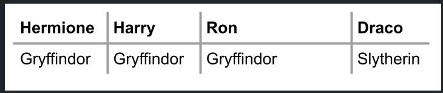
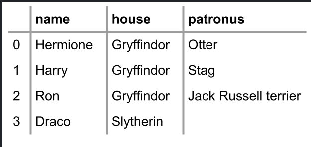

## Dictionaries

- dicts or dictionaries are a data structure that allows you to associate keys with values.
- Where a list is a list of multiple values, a dict associates a key with a value.
- Considering the houses of Hogwarts, we might assign specific students to specific houses.



- We could use lists alone to accomplish this:

```py
students = ["Hermione", "Harry", "Ron", "Draco"]
houses = ["Gryffindor", "Gryffindor", "Griffindor", "Slytherin"]
```

Notice that we can promise that we will always keep these lists in order. The individual at the first position of students is associated with the house at the first position of the houses list, and so on. However, this can become quite cumbersome as our lists grow!

- We can better our code using a dict as follows:

```py
students = {
    "Hermione": "Gryffindor",
    "Harry": "Gryffindor",
    "Ron": "Gryffindor",
    "Draco": "Slytherin",
}
print(students["Hermione"])
print(students["Harry"])
print(students["Ron"])
print(students["Draco"])
```

Notice how we use {} curly braces to create a dictionary. Where lists use numbers to iterate through the list, dicts allow us to use words.

- Run your code and make sure your output is as follows:

$ python hogwarts.py
Gryffindor
Gryffindor
Gryffindor
Slytherin
We can improve our code as follows:
```py
students = {
"Hermione": "Gryffindor",
"Harry": "Gryffindor",
"Ron": "Gryffindor",
"Draco": "Slytherin",
}
for student in students:
print(student)
```
Notice how, executing this code, the for loop will only iterate through all the keys, resulting in a list of the names of the students. How could we print out both values and keys?

Modify your code as follows:
```py
students = {
"Hermione": "Gryffindor",
"Harry": "Gryffindor",
"Ron": "Gryffindor",
"Draco": "Slytherin",
}
for student in students:
print(student, students[student])
```py
Notice how students[student] will go to each student’s key and find the value of their house. Execute your code, and you’ll notice how the output is a bit messy.

- We can clean up the print function by improving our code as follows:
```py
students = {
"Hermione": "Gryffindor",
"Harry": "Gryffindor",
"Ron": "Gryffindor",
"Draco": "Slytherin",
}
for student in students:
print(student, students[student], sep=", ")
```
Notice how this creates a clean separation of a , between each item printed.

If you execute python hogwarts.py, you should see the following:

$ python hogwarts.py

Hermione, Gryffindor
Harry, Gryffindor
Ron, Gryffindor
Draco, Slytherin
What if we have more information about our students? How could we associate more data with each of the students?


- You can imagine wanting to have lots of data associated with multiple keys. Enhance your code as follows:
```py
students = [
    {"name": "Hermione", "house": "Gryffindor", "patronus": "Otter"},
    {"name": "Harry", "house": "Gryffindor", "patronus": "Stag"},
    {"name": "Ron", "house": "Gryffindor", "patronus": "Jack Russell terrier"},
    {"name": "Draco", "house": "Slytherin", "patronus": None},
]
```
Notice how this code creates a list of dicts. The list called students has four dicts within it: One for each student. Also, notice that Python has a special None designation where there is no value associated with a key.

Now, you have access to a whole host of interesting data about these students. Now, further modify your code as follows:
```py
students = [
    {"name": "Hermione", "house": "Gryffindor", "patronus": "Otter"},
    {"name": "Harry", "house": "Gryffindor", "patronus": "Stag"},
    {"name": "Ron", "house": "Gryffindor", "patronus": "Jack Russell terrier"},
    {"name": "Draco", "house": "Slytherin", "patronus": None},
]

for student in students:
    print(student["name"], student["house"], student["patronus"], sep=", ")
```
Notice how the for loop will iterate through each of the dicts inside the list called students.