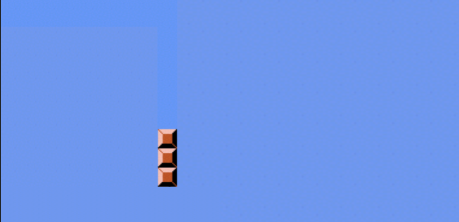
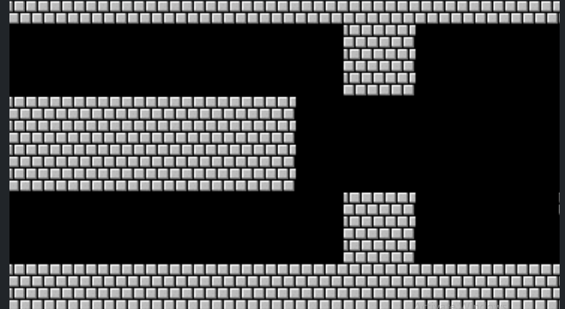

# Mario

- Remember that the classic game Mario has a hero jumping over bricks. Let’s create a textual representation of this game.
  

Begin coding as follows:

```py
print("#")
print("#")
print("#")
```

Notice how we are copying and pasting the same code over and over again.

Consider how we could better the code as follows:

```py
for _ in range(3):
    print("#")
```

Notice how this accomplishes essentially what we want to create.

Consider: Could we further abstract for solving more sophisticated problems later with this code? Modify your code as follows:

```py
def main():
    print_column(3)


def print_column(height):
    for _ in range(height):
        print("#")


main()
```

Notice how our column can grow as much as we want without any hard coding.

Now, let’s try to print a row horizontally. Modify your code as follows:

```py
def main():
    print_row(4)


def print_row(width):
    print("?" * width)


main()
```

Notice how we now have code that can create left-to-right blocks.

Examining the slide below, notice how Mario has both rows and columns of blocks.



- Consider: How could we implement both rows and columns within our code? Modify your code as follows:
```py
def main():
    print_square(3)


def print_square(size):

    # For each row in square
    for i in range(size):

        # For each brick in row
        for j in range(size):

            #  Print brick
            print("#", end="")

        # Print blank line
        print()


main()
```
Notice that we have an outer loop that addresses each row in the square. Then, we have an inner loop that prints a brick in each row. Finally, we have a print statement that prints a blank line.

We can further abstract away our code:
```py
def main():
    print_square(3)


def print_square(size):
    for i in range(size):
        print_row(size)


def print_row(width):
    print("#" * width)


main()
```